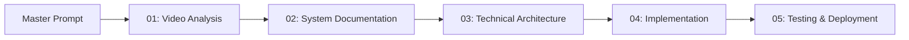

# Trading Bot Development Prompts

Complete prompt sequence for building an automated trading bot from video analysis.

## 📁 Repository Structure
```
bot_development/               # Trading bot development
├── README.md
│── trading_bot_master_prompt.md
│── trading_bot_01_video_analysis.md
│── trading_bot_02_system_documentation.md
│── trading_bot_03_technical_architecture.md
│── trading_bot_04_implementation.md
│── trading_bot_05_testing_deployment.md
│── outputs/                   # Example outputs (optional)
└── .gitkeep
```

## Workflow Overview


## Prompts in This Series

1. **[Master Prompt](trading_bot_master_prompt.md)** - Project overview and planning
2. **[Video Analysis](trading_bot_01_video_analysis.md)** - Extract trading methodology from video
3. **[System Documentation](trading_bot_02_system_documentation.md)** - Formalize trading rules
4. **[Technical Architecture](trading_bot_03_technical_architecture.md)** - Design system architecture
5. **[Implementation](trading_bot_04_implementation.md)** - Code generation guidance
6. **[Testing & Deployment](trading_bot_05_testing_deployment.md)** - Validation and launch

## Prerequisites
- Access to Gemini 1.5 Pro (for video analysis)
- YouTube video URL or file
- Basic understanding of trading concepts
- Python development environment

## Expected Timeline
- Video Analysis: 30-45 minutes
- System Documentation: 1-2 hours
- Technical Architecture: 2-3 hours
- Implementation: 5-10 hours
- Testing: 3-5 hours

## Tips for Success
- Complete prompts in sequence
- Validate each output before proceeding
- Save all intermediate outputs
- Review the entire methodology before coding

## Related Categories
- [Market Analysis](../market_analysis/)
- [Backtesting](../backtesting/)